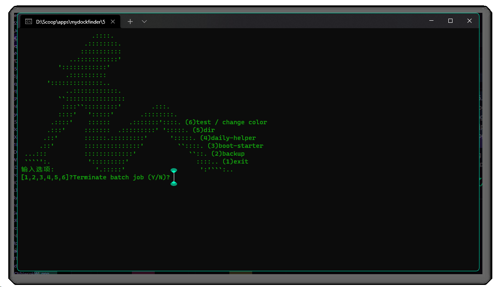

<!--
 * @Author: Weidows
 * @Date: 2020-11-28 17:36:36
 * @LastEditors: Weidows
 * @LastEditTime: 2022-08-24 12:25:44
 * @FilePath: \Keeper\README.md
 * @Description:
-->

<h1 align="center">

- ## 🌈Keeper

一些实用的的定时任务集合(线上/线下组合拳).

</h1>

# GitHub-Action

- [x] daily-push `刷绿 profile 格子` (Fork 项目不被计数刷绿; 主旨非作弊行为 [\[1\]](#cite_note-1)
- [x] 获取`必应壁纸`,存储在 tasks 分支的 Bing 里面 [\[2\]](#cite_note-2)
- [x] 同步 github 仓库到 gitee. [\[3\]](#cite_note-3)
- [x] 访问唤醒+检查 SSL 状态 [(如 LeanCloud 评论后台 / 博客后台,Demo 地址)](https://weidows-projects.github.io/Keeper/) [\[4\]](#cite_note-4)
- [x] 调用 dailycheckin / automihoyobbs 定时任务 [\[5\]](#cite_note-5) [\[6\]](#cite_note-6)
- [x] 调用更新 waka-box [\[10\]](#cite_note-10)

- 进入 settings 配置 secret :

  |         name         |                                                                               value (不会泄露,未填的项不会启用)                                                                               |
  | :------------------: | :-------------------------------------------------------------------------------------------------------------------------------------------------------------------------------------------: |
  |      PUSH_EMAIL      |                                                                         github 推送邮箱 (默认使用 Github-action[bot])                                                                         |
  |         URL          |                                                   唤醒+SSL-Check,支持多个如 `weidows.avosapps.us www.baidu.com` 注意只能是域名不能有前后缀                                                    |
  |      GITEE_RSA       | 私钥文件内容; 公钥复制到 [用户设置](https://gitee.com/profile/sshkeys); 如何生成秘钥可以查看 [这篇文章](https://weidows.github.io/post/experience/SSH); 需要提前在 gitee 创建同名同邮箱的仓库 |
  |     GITEE_TOKEN      |                                            用于镜像时自动创建不存在的仓库,Gitee 可以在[这里](https://gitee.com/profile/personal_access_tokens)找到                                            |
  | DAILY_CHECKIN_CONFIG |                                                       [dailycheckin](https://github.com/Sitoi/dailycheckin) 的 config.json 配置文件内容                                                       |
  | AUTOMIHOYOBBS_CONFIG |                                                     [automihoyobbs](https://github.com/Womsxd/AutoMihoyoBBS) 的 config.json 配置文件内容                                                      |
  |   WAKATIME_API_KEY   |                                                                                 waka-box 需要的 wakatime API                                                                                  |
  |       GH_TOKEN       |                                                                       更新 waka-box 需要用带有 Gist 权限的 GitHub TOKEN                                                                       |

# 本机

- 全堆在 [utils.bat](./utils.bat) 里,注释很明确; 下图为样式

  

- [x] 备份各种开发配置信息 (包括装的软件/SDK,每个工具装的库,config 文件...)

  `机子有价,数据无价`,可参考我的备份仓库: [Weidows-projects/Programming-Configuration](https://github.com/Weidows-projects/Programming-Configuration)

- [x] 各平台每日签到,某些交给 github-action 容易被查封,所以在本机手动跑.
- [x] [原创用于 aria2 后台启动最佳方案](./scripts/aria2.bat)
- [x] [原创 Hello 图床多线程增量备份脚本.](./scripts/hello.py)
- [x] [刷新本机 GitHub520 - hosts](./scripts/GitHub520/) [\[7\]](#cite_note-7) [\[8\]](#cite_note-8) [\[9\]](#cite_note-9)

  非 append/overwrite, 不会改变其他 host; [此处 Release 中打包好了 64 位可执行文件](https://github.com/Weidows-projects/scoop-3rd/releases/tag/1.0.0)

# 借物表

<a name='cite_note-1' href='#cite_ref-1'>[1]</a>: [justjavac/auto-green](https://github.com/justjavac/auto-green)

<a name='cite_note-2' href='#cite_ref-2'>[2]</a>: [mstf/bingdownload](https://gitee.com/mstf/bingdownload)

<a name='cite_note-3' href='#cite_ref-3'>[3]</a>: [Yikun/hub-mirror-action](https://github.com/Yikun/hub-mirror-action/)

<a name='cite_note-4' href='#cite_ref-4'>[4]</a>: [ChenYFan/ssl](https://github.com/ChenYFan/ssl)

<a name='cite_note-5' href='#cite_ref-5'>[5]</a>: [Sitoi/dailycheckin](https://github.com/Sitoi/dailycheckin)

<a name='cite_note-6' href='#cite_ref-6'>[6]</a>: [Womsxd/AutoMihoyoBBS](https://github.com/Womsxd/AutoMihoyoBBS)

<a name='cite_note-7' href='#cite_ref-7'>[7]</a>: [521xueweihan/GitHub520](https://github.com/521xueweihan/GitHub520)

<a name='cite_note-8' href='#cite_ref-8'>[8]</a>: https://github.com/mbuilov/sed-windows

<a name='cite_note-9' href='#cite_ref-9'>[9]</a>: https://github.com/islamadel/bat2exe

<a name='cite_note-10' href='#cite_ref-10'>[10]</a>: https://github.com/YouEclipse/waka-box-go
